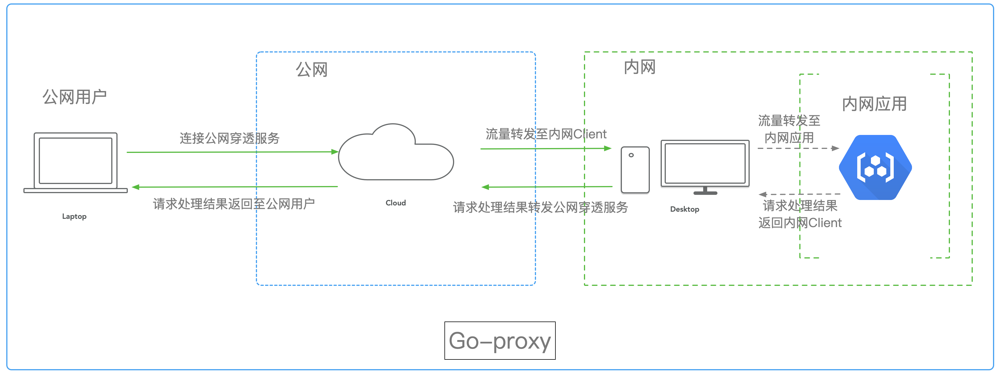

# 内网穿透小工具

## 1.架构图


## 2.目录结构
```shell script
.
├── README.md
├── client              // 内网环境client程序
│   ├── client.go
│   ├── handle.go       // 内网环境下流量转发处理
│   ├── local.go
│   └── main.go         
├── go.mod              // go module依赖文件
├── server              // 公网环境server程序
│   ├── client.go
│   ├── handle.go       // 公网server流量转发处理
│   ├── main.go
│   └── user.go
└── src
    └── go-proxy.png    // markdown图片资源
```
## 3.程序启动
```shell script
# 启动公网server 
# -p:提供给用户访问的端口号
# -r:远程公网server上进行流量转发的端口号(提供给client进行连接)
go run server/main.go -r 3333 -p 8081

# 启动本地client
# -r:远程公网server提供流量转发的端口
# -l:内网client上即将提供给外网访问的应用服务A端口
go run client/main.go -r 3333 -l 8080

```
`连接成功后，即可通过http://{serverIp}:8081访问内网上的应用服务A`